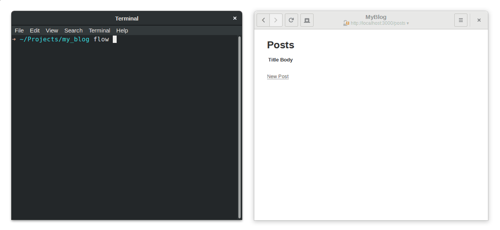

# Flow [](https://travis-ci.org/viseztrance/flow)

Flow is a [tail](https://en.wikipedia.org/wiki/Tail_(Unix)) like tool that can
group and filter out data.



## Installation

Currently there are no prebuilt binaries, but with the help of people such as
yourself, this will change.

Flow depends on `ncurses` and `libreadline` (6.3+).

These can be installed on `ubuntu` using the following command:

    sudo apt-get install libncurses5-dev libncursesw5-dev libreadline-dev

And on `fedora`:

    sudo dnf install ncurses-devel readline-devel

Install [rust](https://www.rust-lang.org)

Run `cargo install flow`

## Usage

At a minimum, you can just provide the path to the log file you're interested in:

    flow path/to/log <options>

Once started, you can search through the log lines with `Control + F` or `/`.

To filter data, you'll need a config file that can be generated by running:

    flow --init <directory or file name>

You can load it by:

    flow path/to/log -c path/to/config

If you haven't specified the `-c` flag, flow also tries to load a `.flow` config
file from your current directory or home folder.

## Writing your own config file

Let's have a look at a sample config:

```toml
[[filters]]
name = "All"

[[filters]]
name = "Having xyz"
contains = "(?i)xyz"

[[filters]]
name = "Errors"
contains = "(?i)xyz"
starts_with = "Started (?P<matching>POST)?"
ends_with = "Completed (?P<matching>500)?"
```

This config creates three menu filters, between which you can navigate by using
the arrow keys. Only lines matching each filter's conditions are shown.

The first filter creates a menu item named "All" that matches every line from
the provided log file.

The second one has an extra option named `contains`, that *needs* to have a
valid [regex](https://doc.rust-lang.org/regex/regex/index.html#syntax) syntax.
In this example, only lines containing `xyz` (case insensitive) will be shown.

The last filter has two extra options named `starts_with` and `ends_with` which
also need to be valid regexes. This example will yield every line between the
ones matching `Started POST` and `Completed 500`, as long as in between there is
at least one containing `xyz`.

To yield the right content, it's very important to match all starting and end
lines even if we have no interest in them – for example, in our case values such
as "Started GET" or "Completed 200". The named capture `(?P<matching>...)?`
tells apart valid from invalid content.

However you can very well use `starts_with` without `ends_with`, and vice versa:

```toml
[[filters]]
name = "Post requests"
starts_with = "Started (?P<matching>POST)?"
```

## License

This is free software, licensed under GPLv3.
